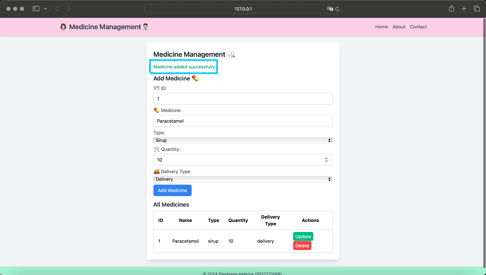
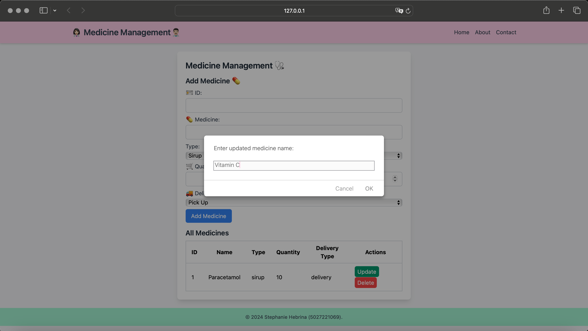
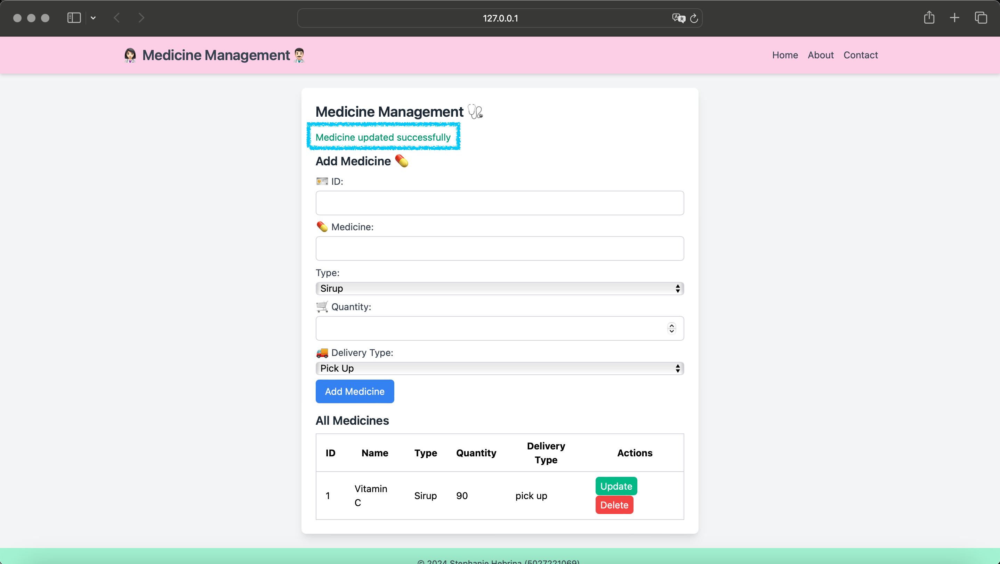
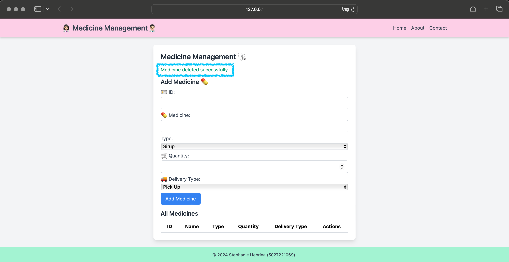
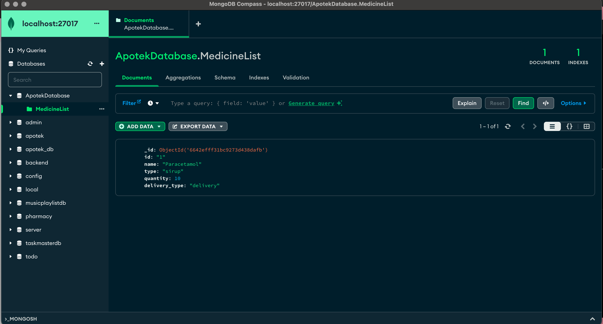

# Sistem Manajemen Apotek

| Nama | NRP |
|-----------------|-----------------|
| Stephanie Hebrina Mabunbun Simatupang    | 5027221069    |

**Soal :**
1. Buatlah project individu yang mengimplementasikan gRPC API dan protobuf menggunakan bahasa pemrograman apa pun ✅
2. Project memiliki ketentuan sebagai berikut:

    • Memiliki fitur Create, Read, Update, Delete data ✅

    • Koneksi ke database (MongoDB atau yang lainnya) ✅

    • Backend CRUD ke database ✅

    • Mengimplementasikan UI ✅

**Deskripsi Sistem Manajemen Apotek :**
Dengan menggunakan sistem ini, kita dapat melihat ID pelanggan, Nama obat yang dibeli, Jenis obat, Jumlah obat yang mau dibeli, dan Jasa pengirimannya. 

**Memiliki fitur Create, Read, Update, Delete data :** 
Create : Menambahkan informasi tentang obat yang akan dibeli ke dalam database. 

Read : Membaca atau mengambil informasi yang ada dari dari database.

Update : Memperbarui informasi yang sudah ada dalam sistem manajemen apotek.

Delete : Menghapus entri atau informasi dari sistem manajemen apotek.

## Dokumentasi Website :
A. Add Medicine 

Tampilan diatas akan muncul "Medicine added successfully" yang berarti obat sudah berhasil ditambahkan

B. Update Medicine

Jika kita click Update di kolom Actions, akan otomatis muncul seperti ini :

Kemudian jika berhasil update :

"Medicine updated successfully" yang berarti obat sudah berhasil diganti

C. Delete Medicine 

Tampilan diatas akan muncul "Medicine deleted successfully" yang berarti obat sudah berhasil dihapus

D. Isi mongoDB 

Full demo : https://youtu.be/N5P-ueIXYa0?si=zVIF8w0ncfaEHBfQ 